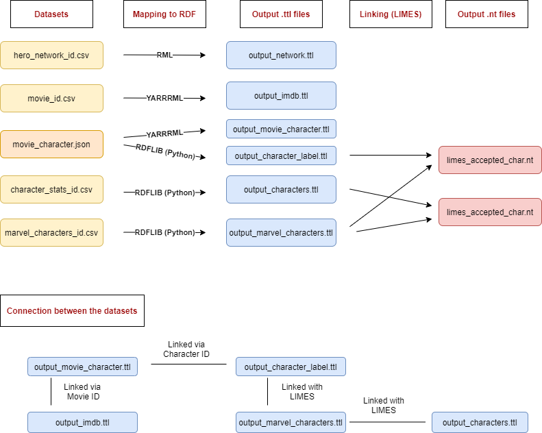

# knowledge_graphs_project
This project is created for the university course Building and Mining Knowledge Graphs.

The aim is to build a graph about the Marvel Universe combining different datasets. The sources are:
* [hero-network](https://www.kaggle.com/csanhueza/the-marvel-universe-social-network)
* [IMDB information about Marvel movies](https://www.kaggle.com/leonardopena/marvel-vs-dc)
* [character information about Marvel superheroes](https://www.kaggle.com/dannielr/marvel-superheroes)

The main steps of the project:
* Relevant parts of the datasets are carefully selected.
* After preprocessing, the data files are converted into RDF syntax, using different techniques (**RML, YARRRML, RDFlib**).
* To connect the resulting output files, **LIMES** is utilized to link entities from different sources.
* Finally, 2 graphs are build in **GraphDB** from the TURTLE files. One shows the hero-network, and the other contains the information about which characters play in a certain movie, and what are the characteristics of these films and heroes. 
* Using **SPARQL** on the mentioned graphs, we receive answers to some interesting questions.

Summary of the process:

A snippet of the knowledge graph:

